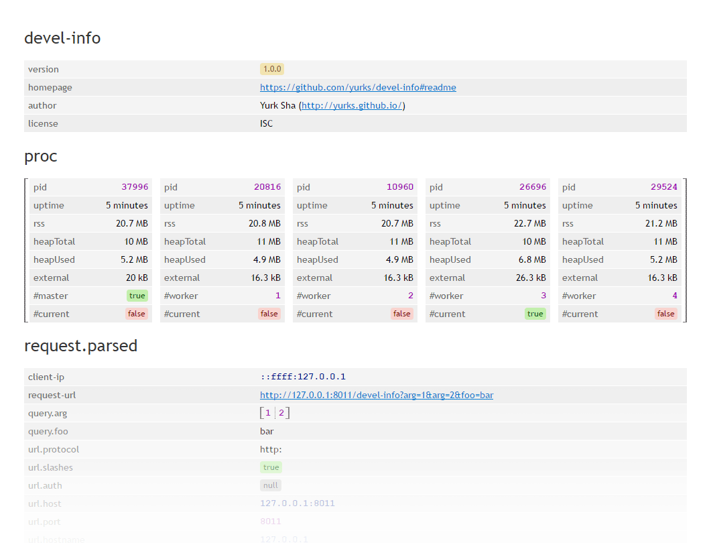

# devel-info

Collect dev-related data in node.js apps (environment, cluster, process, system, request...) and show it in pretty format.
May be useful for overall application state overview in production environments.



## Installation

Use `npm` to install it to your app:

    npm install --save devel-info


## Usage

### As node server or connect/express middleware

Run following script:

```js
var develInfo = require('devel-info');

// for node server
require('http')
    .createServer(develInfo())
    .listen(8011);

// or for connect middleware
require('connect')()
    .use(develInfo())
    .listen(8011);
```

and navigate to `http://127.0.0.1:8011/devel-info` after application starts.

Additional initialization should be applied on cluster setup to collect information about workers: 

```js
var develInfo = require('devel-info');
var cluster = require('cluster');
develInfo.initCluster(cluster);

if (cluster.isMaster) {
   // master init
} else {
   // workers init
}
```

See [example](example/index.js) for working solution. 

### As standalone function  

```js
var develInfo = require('devel-info');

develInfo(function(err, data) {
    if (!err) {
        console.log(data);
    }
});
```

## Options

    develInfo([config], [callback], [clientRequest|])

1. `config` could be an object with following options:
    * `url` — url for devel-info page (default: `'/devel-info'`).
    * `type` — output format (default: `'html'` for using as middleware or `'json'` for using with callback)
    * `sections` — info sections collected from node app environment (default: `['package', 'proc', (config.custom), 'request', 'request.parsed', 'request.headers', 'request.headers.cookie', 'os', 'process', 'process.env', 'os.networkInterfaces']`)
    * `custom` — custom object with any data to show in devel-info page (default: `undefined`) 
    
    `config` could be `String` or `Array` and will be treated as `sections` option in this case. Also, `config` argument could be skipped — the defaults will be used.
 
2. `callback` is a function which called on info gathering finish. Use it if you want to control all this stuff manually ;) 

3. `clientRequest` is a [node object](https://nodejs.org/api/http.html#http_class_http_clientrequest) which represents an in-progress request.
Used for collecting request-related information and make sense only when using `callback`. 

## Demo

Run directly from your application root for quick demonstration:

    node node_module/devel-info/example

## License

[MIT license](LICENSE)
